# Backtesting With The Console

Amazon Lookout for Metrics supports backtesting against your historical information and in this notebook we will demonstrate this functionality on the same dataset you just prepped. Once the backtesting job has completed you can see all of the anomalies that Amazon Lookout for Metrics detected in the last 30% of your historical data. From here you can begin to unpack the kinds of results you will see from Amazon Lookout for Metrics in the future when you start streaming in new data. **NOTE YOU MUST CREATE A NEW DETECTOR TO LEVERAGE REAL TIME DATA. BACKTESTING IS ONLY FOR EXPLORATION.**

Before continuing, please complete the following notebooks:

1. `1.PrereqSetupPackages.ipynb` - Not Strictly Needed
1. `2.PrereqSetupData.ipynb` - Absolutely Needed (Sets up data, and an IAM role)

## Prework 

Before launching into the console you will first need to obtain a few pieces of information from the second notebook. This information will be used as inputs for a few form fields in the console.

1. **S3_Backtesting_Data_URI** - This is the URI can be found in the second notebook by combining the s3_bucket name AND this path `data/ecommerce/backtest/input.csv`. For example bucket `05922124553121-lookoutmetrics-lab` and that string would make for: `s3://059124553121-lookoutmetrics-lab/ecommerce/backtest/input.csv`
1. **IAM_ROLE_ARN** - This can also be found inside the second notebook, it should have been in the output of your last cell and should look something like: `arn:aws:iam::0591245532121:role/L4MTestRole`

Save those values from the second notebook and you are ready to get started!

## Creating A Detector

Now the basic external resources are ready, so it is time to get started with Amazon Lookout for Metrics, that starts with creating a `Detector`.

### Detectors

To detect outliers, Amazon Lookout for Metrics builds a machine learning model that is trained with your source data. This model, called a `Detector`, is automatically trained with the machine learning algorithm that best fits your data and use case. You can either provide your historical data for training, if you have any, or get started with real-time data, and Amazon Lookout for Metrics will learn on-the-go. In this example for `Backtesting` you will only be providing historical data.

To get started, first in a new window login to your AWS Account and then visit: https://us-west-2.console.aws.amazon.com/lookoutmetrics/home?region=us-west-2#landing

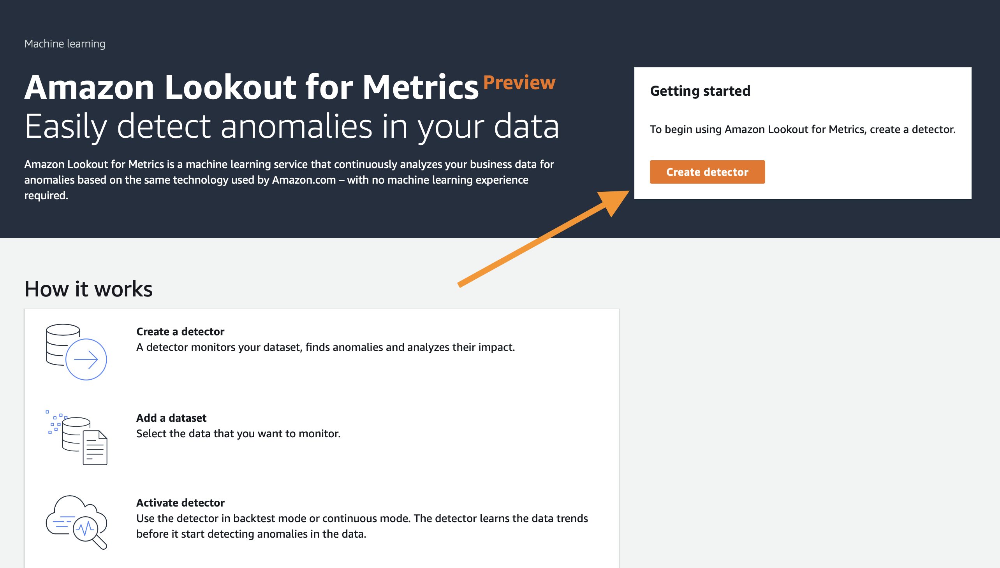

Click the `Create detector` button to continue.

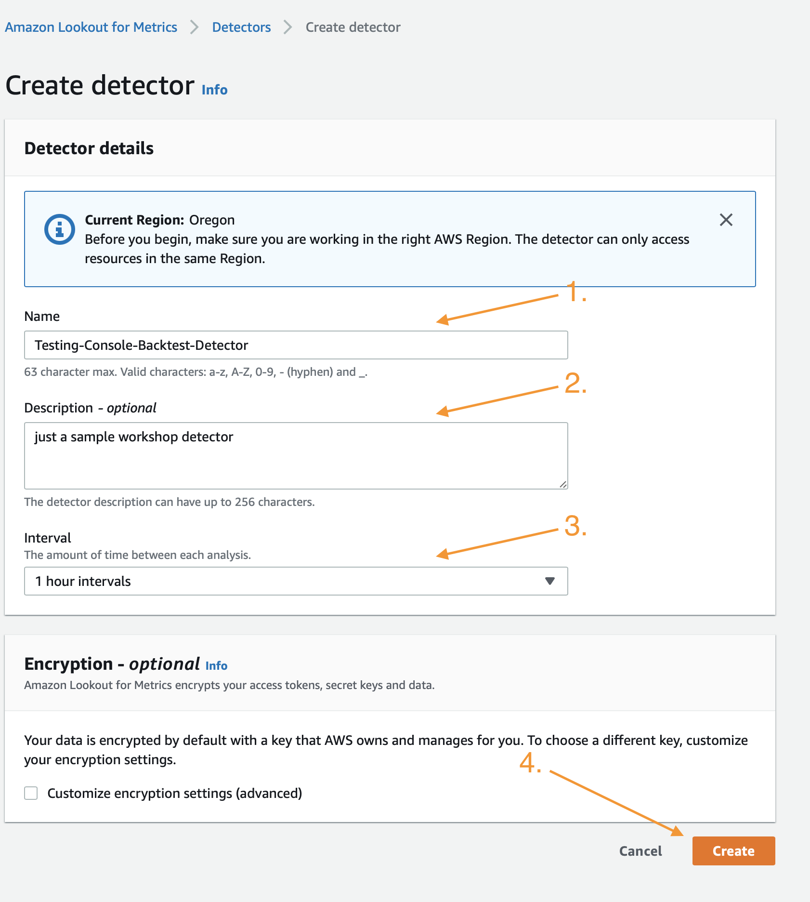

In the first cell you must give your `Detector` a name, anything that matches the validation check will do. Also add a description and select `1 hour intervals` at step 3 in order to work with the sample data provided. You can optionally modify encryption settings if needed, but otherwise clicking `Create` will progress you to the next step where you define your dataset and metrics.

Once you have clicked create you will see:

## Define Metrics

### Measures and Dimensions

`Measures` are variables or key performance indicators on which customers want to detect outliers and `Dimensions` are meta-data that represent categorical information about the measures. 

In this E-commerce example, views and revenue are our measures and platform and marketplace are our dimensions. Customers may want to monitor their data for anomalies in number of views or revenue for every platform, marketplace, and combination of both. You can designate up to five measures and five dimensions per dataset.

### Metrics 


After creating a detector, and mapping your measures and dimensions, Amazon Lookout for Metrics will analyze each combination of these measures and dimensions. For the above example, you have of 7 unique values (us, jp, de, etc.) for marketplace and 3 unique values (mobile web, mobile app, pc web) for platform for a total of 21 unique combinations. Each unique combination of measures with the dimension values (e.g. us/mobile app/revenue) is a time series `metric`. In this case, you have 21 dimensions and 2 measures for a total of 42 time-series `metrics`. 

Amazon Lookout for Metrics detects anomalies at the most granular level so you are able to pin-point any unexpected behavior in your data.

### Datasets

Measures, dimensions and metrics map to `datasets`, which also contain the Amazon S3 locations of your source data, an IAM role that has both read and write permissions to those Amazon S3 locations, and the rate at which data should be ingested from the source location (the upload frequency and data ingestion delay).

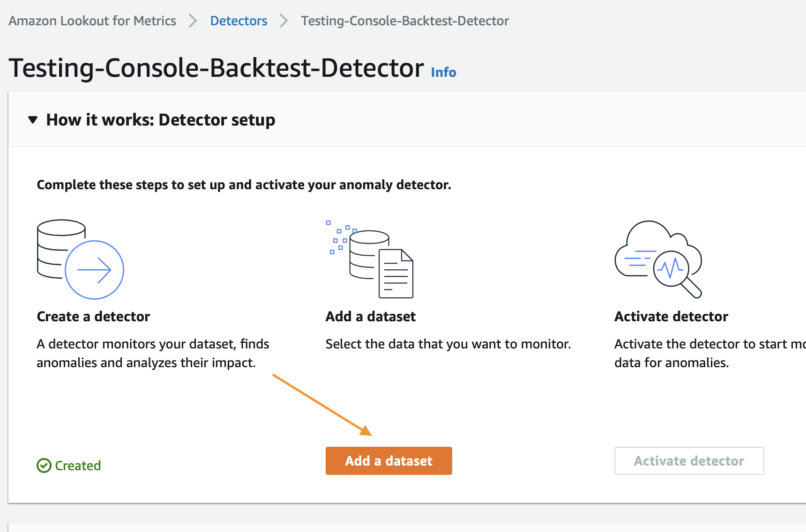

Click the `Add a dataset` button to continue.

In the next screen fill out the fields for `Name`, `Description`, and `Timezone` as shown and then click the drop down for the `Datasource`, select `Amazon S3`

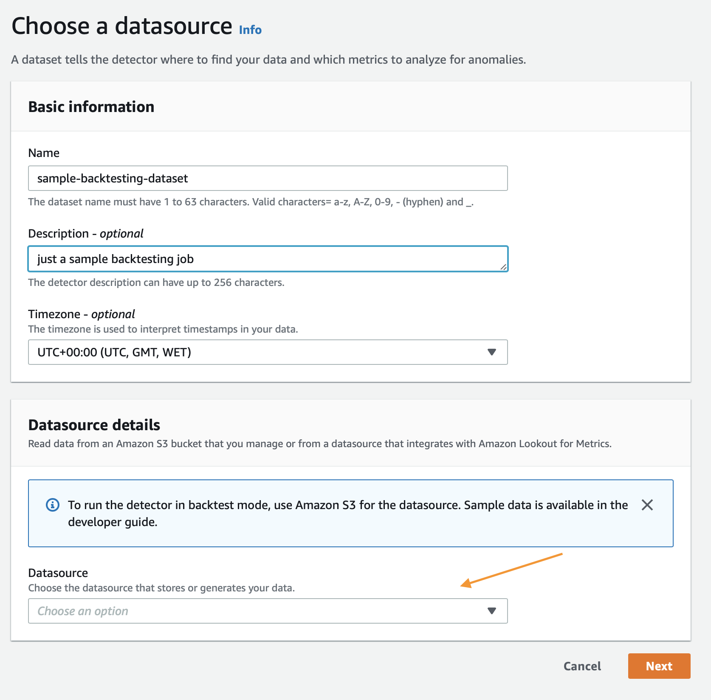


After selecting S3, select the `Backtest` option:

1. Provide the earlier S3_URI for `Historical data`.
1. Select Today's date as the most recent date.
1. Leave all the default boxes alone, and paste your `IAM_ROLE_ARN` into the dialog boxes as show below, then click `Next`

Example: 

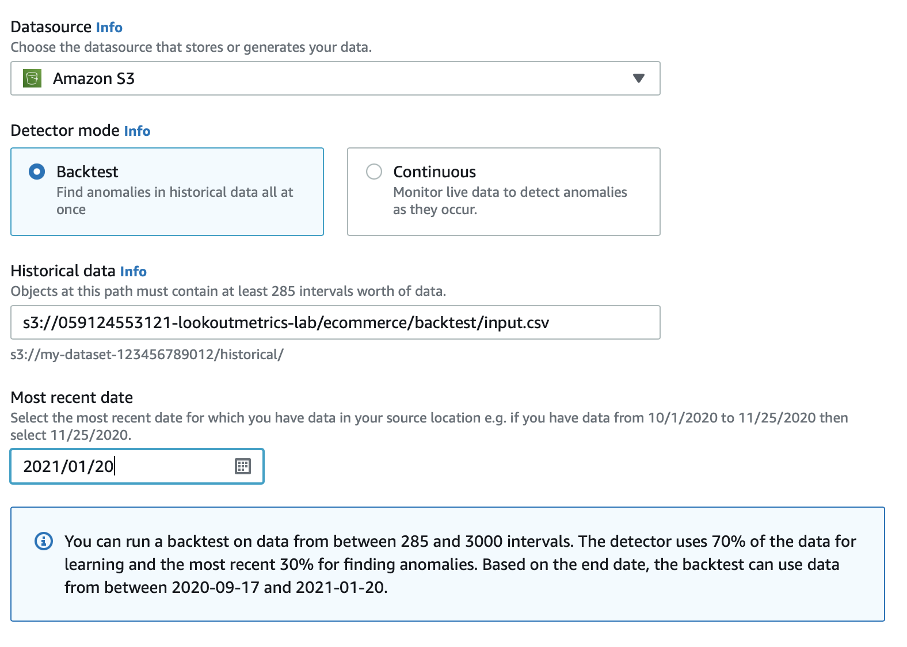

**NOTE** In the console you should have seen something like this:

```
You can run a backtest on data from between 285 and 3000 intervals. The detector uses 70% of the data for learning and the most recent 30% for finding anomalies. Based on the end date, the backtest can use data from between 2020-09-17 and 2021-01-20.
```

This is important! It will update you to the real date ranges that are available based on the datasets and frequencies you provide.

**END NOTE**

Again click `Next` after filling in the ARN for the IAM role:


The service will validate your data, click `OK` to proceed to the next screen.

Fill out the next page as shown here: 

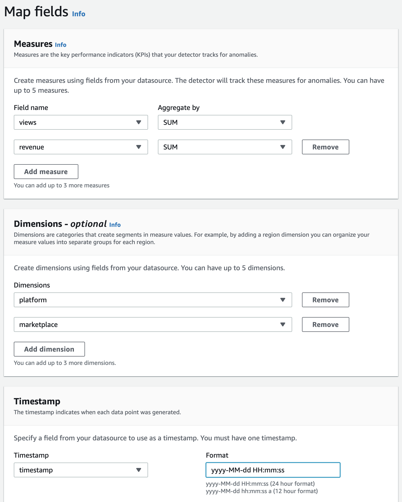

This will define your metrics to be views and revenue, as well as your domains to be platform and marketplace, leaving the timestamp column to be the timestamp. You can obtian the formatting for it from the first example on the console page where it can be copied and pasted. This is just the default time format for 24 hour time in Python's Pandas Package.

After updating these fields, simply scroll to the bottom and click `Next`:

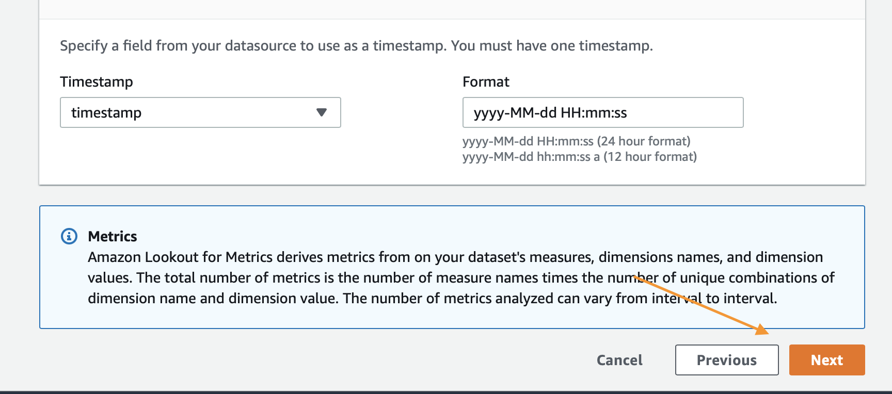

Then scroll to the bottom of that page and click `Save and activate`

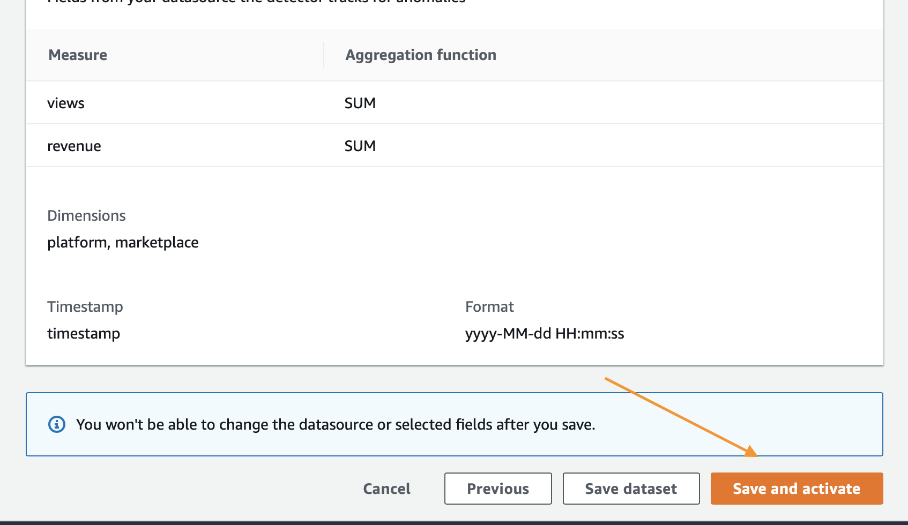

Click `Activate` on the pop-up that is shown, you will be taken back to the main `Detector` page where you can see that the job has been started:

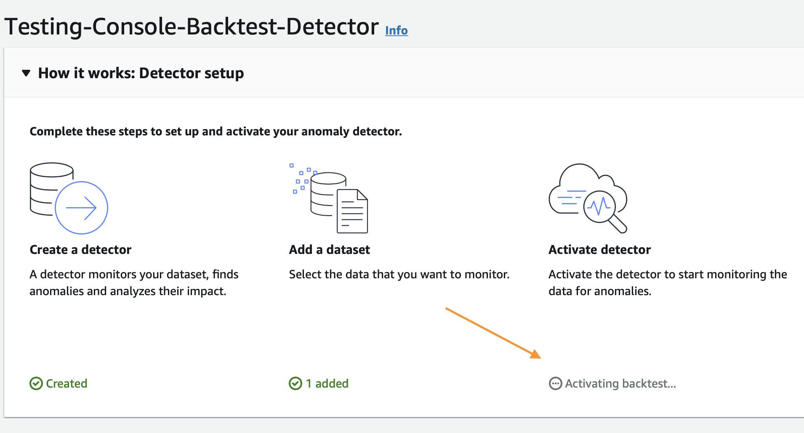

This process will take 20 to 25 minutes to complete so it would be a good time to grab a coffee or checkup on any emails while it continues.

## Reviewing Anomalies

Once the backtest job has completed it will notify you on the `Detector` console page that you left above, you should see something like this:

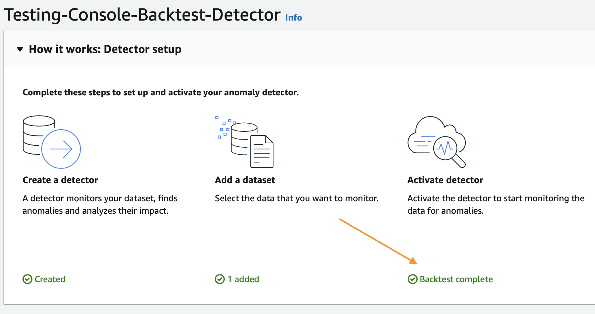

Once you see that it has completed you can click on the `Anomalies` link on the left, that will enable you to browse what was found:

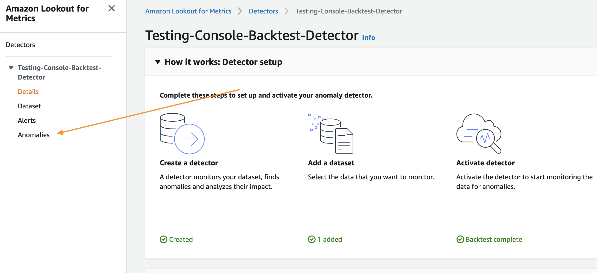

From here you can adjust the slider at the top to browse more or less severe anomalies. You can also click any of the anomalies shown at the bottom to learn more:

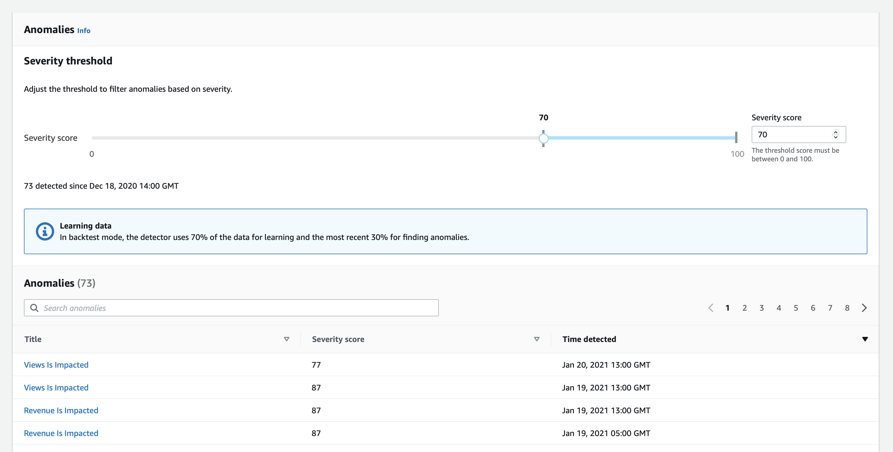

After clicking you can understand more by viewing the page:

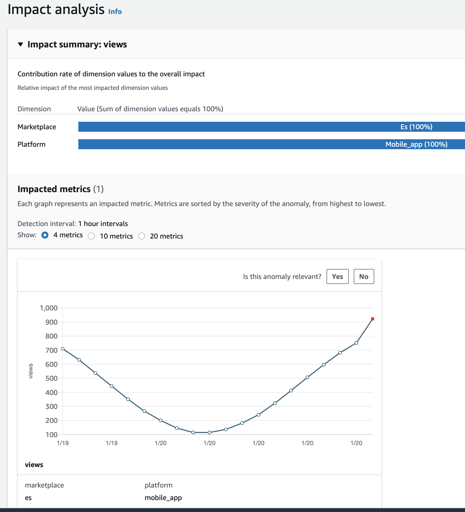

## Cleanup

Simply click the `Detectors` link on any page, then select the `Detector` that you wish to delete and click `Delete`. After that completes, be sure to go to `S3` and delete your bucket, `IAM` and delete your role. 

Before deleting anything though, feel free to explore creating a `Continous` detector in the next file: `ContinousDetectionWithTheConsole.md`

Good luck!