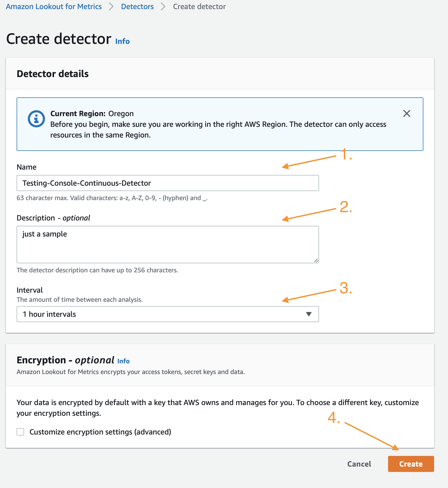
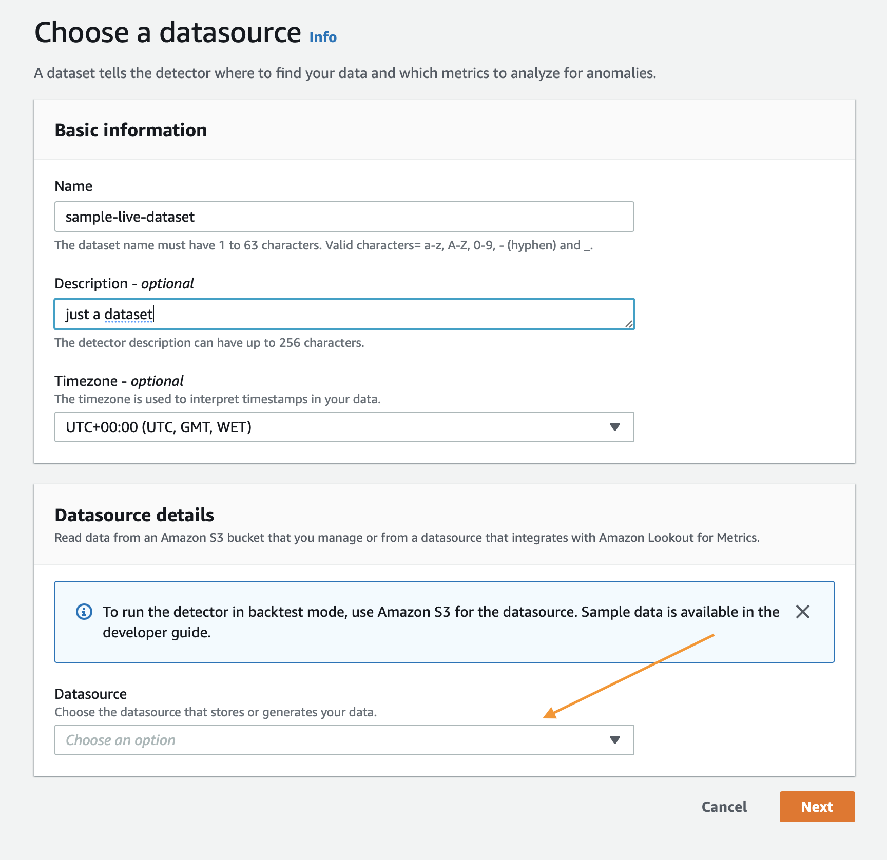
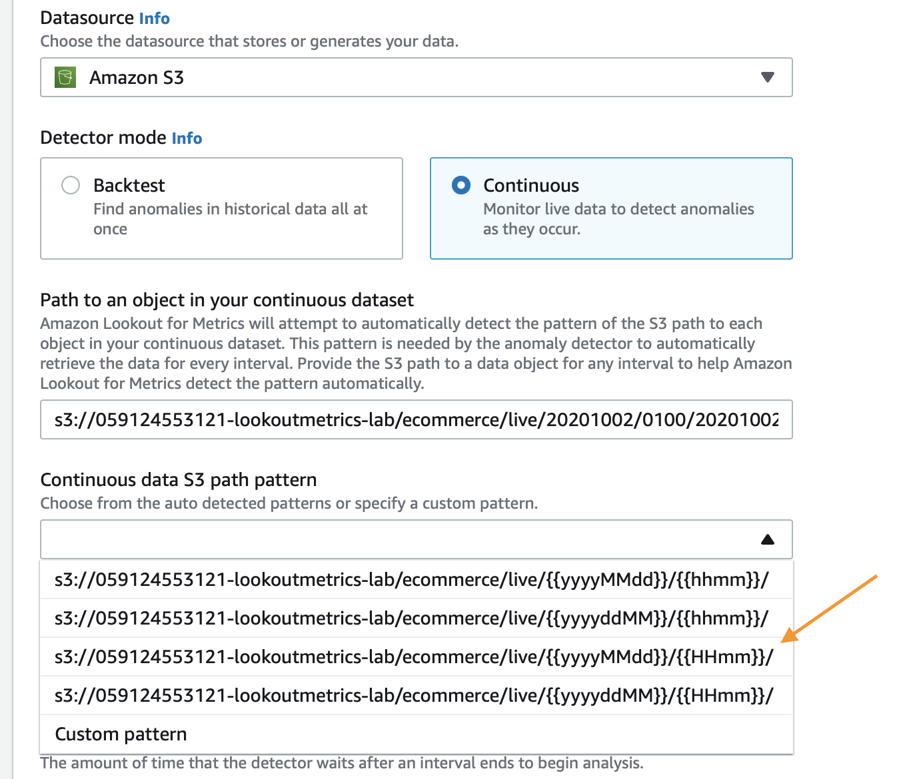
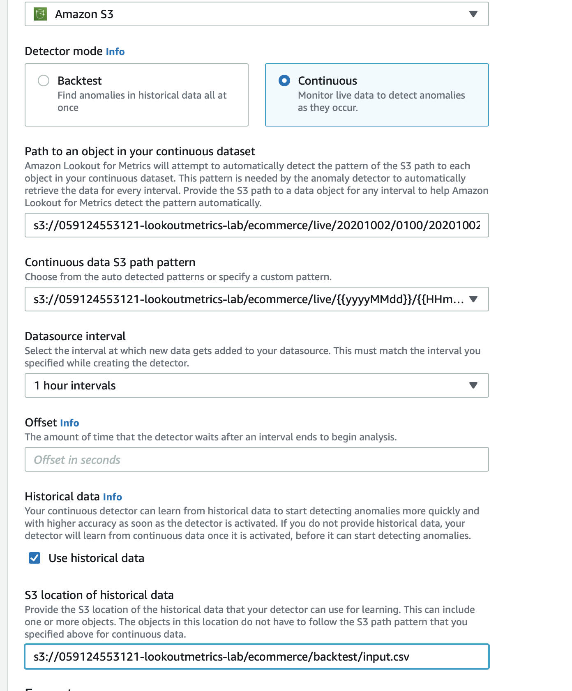
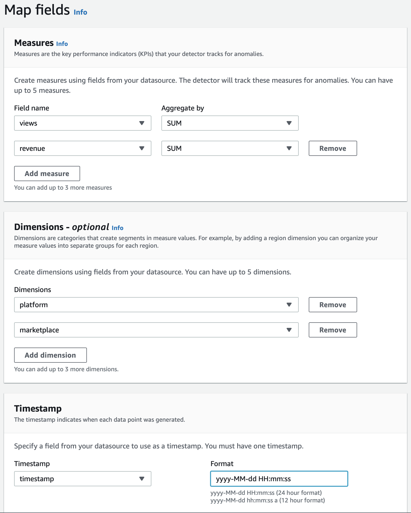
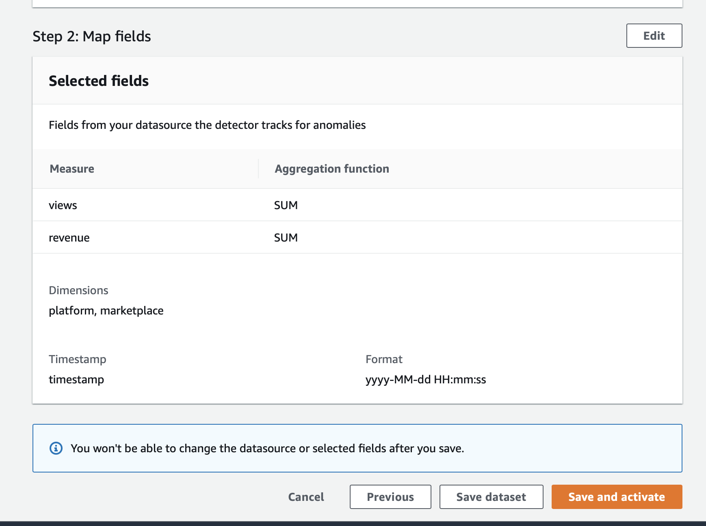
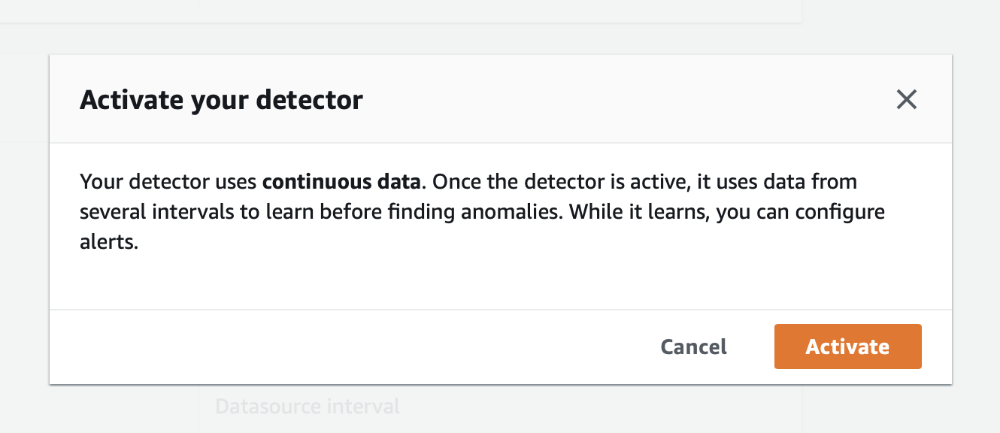

# Continuous Detection With The Console

Amazon Lookout for Metrics supports continuous detection against your streaming information and in this doc you will demonstrate this functionality on the same dataset you just prepped. 

Once the detector is active you will be able to view anomalies in the console and create alerts that notify you via SNS when an anomaly has been completed. Though the setup of the alert is outside of the scope of this guide. You can learn more here: https://docs.aws.amazon.com/lookoutmetrics/latest/dev/detectors-alerts.html or in `4.GettingStartedWithLiveData.ipynb`

Before continuing, please complete the following notebook:

1. `1.PrereqSetupData.ipynb` - Absolutely Needed (Sets up data, and an IAM role)

## Prework 

Before launching into the console you will first need to obtain a few pieces of information from the second notebook. This information will be used as inputs for a few form fields in the console.

1. **S3_Backtesting_Data_URI** - This is the URI can be found in the second notebook by combining the s3_bucket name AND this path `data/ecommerce/backtest/input.csv`. For example bucket `05922124553121-lookoutmetrics-lab` and that string would make for: `s3://059124553121-lookoutmetrics-lab/ecommerce/backtest/input.csv`
1. **S3_Live_Data_URI** - This can be found in your S3 bucket by browsing to the `ecommerce/live/` data folders and beyond until you find a CSV. It should look something like: `s3://059124553121-lookoutmetrics-lab/ecommerce/live/20201002/0100/20201002_010000.csv`, any file in this structure will do.
1. **IAM_ROLE_ARN** - This can also be found inside the second notebook, it should have been in the output of your last cell and should look something like: `arn:aws:iam::0591245532121:role/L4MTestRole`

Save those values from the second notebook and you are ready to get started!

## Creating A Detector

Now the basic external resources are ready, so it is time to get started with Amazon Lookout for Metrics, that starts with creating a `Detector`.

### Detectors

To detect outliers, Amazon Lookout for Metrics builds a machine learning model that is trained with your source data. This model, called a `Detector`, is automatically trained with the machine learning algorithm that best fits your data and use case. You can either provide your historical data for training, if you have any, or get started with real-time data, and Amazon Lookout for Metrics will learn on-the-go. In this example for `Continuous` mode you will only be providing historical data and a path structure for future data. This future data in a real scenario would be streamed in as available. For educational purposes you have already uploaded it in the second notebook.

To get started, first in a new window login to your AWS Account and then visit: https://us-west-2.console.aws.amazon.com/lookoutmetrics/home?region=us-west-2#landing

Click the `Create detector` button to continue.

In the first cell you must give your `Detector` a name, anything that matches the validation check will do. Also add a description and select `1 hour intervals` at step 3 in order to work with the sample data provided. You can optionally modify encryption settings if needed, but otherwise clicking `Create` will progress you to the next step where you define your dataset and metrics.

Once you have clicked create move onto the next section.

## Define Metrics

### Measures and Dimensions

`Measures` are variables or key performance indicators on which customers want to detect outliers and `Dimensions` are meta-data that represent categorical information about the measures. 

In this E-commerce example, views and revenue are our measures and platform and marketplace are our dimensions. Customers may want to monitor their data for anomalies in number of views or revenue for every platform, marketplace, and combination of both. You can designate up to five measures and five dimensions per dataset.

### Metrics 

After creating a detector, and mapping your measures and dimensions, Amazon Lookout for Metrics will analyze each combination of these measures and dimensions. For the above example, you have of 7 unique values (us, jp, de, etc.) for marketplace and 3 unique values (mobile web, mobile app, pc web) for platform for a total of 21 unique combinations. Each unique combination of measures with the dimension values (e.g. us/mobile app/revenue) is a time series `metric`. In this case, you have 21 dimensions and 2 measures for a total of 42 time-series `metrics`. 

Amazon Lookout for Metrics detects anomalies at the most granular level so you are able to pin-point any unexpected behavior in your data.

### Datasets

Measures, dimensions and metrics map to `datasets`, which also contain the Amazon S3 locations of your source data, an IAM role that has both read and write permissions to those Amazon S3 locations, and the rate at which data should be ingested from the source location (the upload frequency and data ingestion delay).

Click the `Add a dataset` button to continue.

In the next screen fill out the fields for `Name`, `Description`, and `Timezone` as shown and then click the drop down for the `Datasource`, select `Amazon S3`

**NOTE** You may notice the `Offset` parameter, this is key for when you have data that can take a while to arrive, it will delay Lookout for Metrics from crawling by this period. Quite helpful for long running jobs that may feed into S3!

After selecting S3, select the `Continuous` option:

1. Provide the earlier S3_URI for `Historical data`.
1. In the first field place the earlier found `S3_Live_Data_URI` above then click on the drop down in the next cell. 

In this screen:

 

Click the 3rd option as shown, this is the correct time format for our data. If you are developing your own structure, please select the valid choice for your data. This dropdown will adapt for your data.

Next you need to specify your time intervals to be 1 hour, then click the box to provide historical data and update it with the other S3 URI you collected earlier:

Lastly you need to provide the ARN defined as well, input that then click `Next`:

The service will validate your data, click `OK` to proceed to the next screen.

Fill out the next page as shown here: 

This will define your metrics to be views and revenue, as well as your domains to be platform and marketplace, leaving the timestamp column to be the timestamp. You can obtian the formatting for it from the first example on the console page where it can be copied and pasted. This is just the default time format for 24 hour time in Python's Pandas Package.

After updating these fields, simply scroll to the bottom and click `Next`:

Then scroll to the bottom of that page and click `Save and activate`

Click `Activate` on the pop-up that is shown, you will be taken back to the main `Detector` page where you can see that the job has been started:

This process will take 20 to 25 minutes to complete so it would be a good time to grab a coffee or checkup on any emails while it continues.

From here you could go define the `Alerts` by clicking on that link on the left. Once real time anomalies are detected, they are viewable in the console like in `Backtesting` and if you have configured an `Alert` then there will be an event sent to that.

## Cleanup

Simply click the `Detectors` link on any page, then select the `Detector` that you wish to delete and click `Delete`. After that completes, be sure to go to `S3` and delete your bucket, `IAM` and delete your role. 

Good luck!